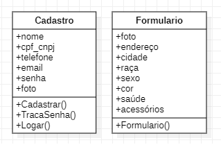

<p>
  <a href="https://opensource.org/licenses/MIT">
    
  </a>
</p>

<div>
  <p align="center">
    
  </p>
</div>

# Introdução
<p> Esse projeto é um API do Site ResgatPet com foco em resgatar pets abandonados e passar para as ONG 's responsáveis, desenvolvido no Senac no Projeto Integrador no curso de Full-Stack. Essa API é responsavel por cadastrar todos os usuarios e formularios de pet econtrados.</p>

Com a API será possivel fazer:
- **Exclusão**: Permite excluir os Usuarios e Pet.
- **Alteração**: Alteração dos Usuarios, Pet, Fotos.
- **Inclusão**: Permite adicionar novos Usuarios, Pets e Upload de Fotos.
- **Consulta**: Consultar Usuarios e Pet.

**Professor**: JOÃO PEDRO PARELLA

## Instalação

```bash
# instalar node_modules
$ npm install
```

## Executando API

```bash
# iniciar o servidor 
$ npm run start
```

```bash
# ativação de recarregamento automático
$ npm run start:dev
```

## Postman

### Upload Foto
```bash
# inclusão de Foto
POST http://localhost:3005/arquivos
Selecione Body, form-data, key arquivo file value asdasdaslo.png

```
### Usuario
```bash
# consultar
POST http://localhost:3005/usuarios/login
Selecione Body, raw, json

{
  "EMAIL": "juvenal_12345@gmail.com",
  "SENHA": "#@afgtu45"
}
```
```bash
# inclusão
POST http://localhost:3005/usuarios
Selecione Body, raw, json

{
  "NOMECOMPLETO": "Juvenal Oliveira da Silva de Souza",
  "CPF_CNPJ": "25558878946",
  "TELEFONE": "14985554700",
  "EMAIL": "juvenal_12345@gmail.com",
  "SENHA": "#@afgtu45",
  "LEVEL": "1"
}
```
```bash
# inclusão Foto Usuario
POST http://localhost:3005/usuarios/foto/{"url da foto"}
Selecione Body, raw, json

{
  "NOMECOMPLETO": "Juvenal Oliveira da Silva de Souza",
  "CPF_CNPJ": "25558878946",
  "TELEFONE": "14985554700",
  "EMAIL": "juvenal_12345@gmail.com",
  "SENHA": "#@afgtu45",
  "LEVEL": "1"
  "FOTO": "asdasdaslo-4d06e95a-4ee7-4195-b48e-6cc05a264de8.png"
}
```
```bash
# consultar
GET http://localhost:3005/usuarios
Selecione Params
```
```bash
# exclusão
DELET http://localhost:3005/usuarios/{"id do usuario"}
Selecione Params
```
```bash
# alteração
PUT http://localhost:3005/usuarios/{"id do usuario"}
Selecione Params
```
```bash
# exemplo json
{
  "NOMECOMPLETO": "Juvenal Oliveira da Silva de Souza",
  "CPF_CNPJ": "25558878946",
  "TELEFONE": "14985554700",
  "EMAIL": "juvenal_12345@gmail.com",
  "SENHA": "#@afgtu45"
}
```
### Formulário

```bash
# inclusão
POST http://localhost:3005/formulario
Selecione Body, raw, json

{
  "ENDERECO": "Rua Lopes 1734",
  "CIDADE": "Bauru",
  "SEXO": "Macho",
  "RACA": "Poodle",
  "COR": "Branco",
  "SAUDE": "Ferido",
  "ACESSORIO": "Coleira",  
  "USUARIO": "Juvenal Oliveira da Silva de Souza"
}
```
```bash
# inclusão Foto Pet
POST http://localhost:3005/formulario/foto/{"url da foto"}
Selecione Body, raw, json

{
  "ENDERECO": "Rua Lopes 1734",
  "CIDADE": "Bauru",
  "SEXO": "Macho",
  "RACA": "Poodle",
  "COR": "Branco",
  "SAUDE": "Ferido",
  "ACESSORIO": "Coleira", 
  "USUARIO": "Juvenal Oliveira da Silva de Souza"
  "FOTOPET": "asdasdaslo-4d06e95a-4ee7-4195-b48e-6cc05a264de8.png"
}
```
```bash
# consultar
GET http://localhost:3005/formulario
Selecione Params
```
```bash
# exclusão
DELET http://localhost:3005/formulario/{"id do formulario"}
Selecione Params
```
```bash
# alteração
PUT http://localhost:3005/formulario/{"id do formulario"}
Selecione Params
```
```bash
# exemplo json
{
  "ENDERECO": "Rua Lopes 1734",
  "CIDADE": "Bauru",
  "SEXO": "Macho",
  "RACA": "Poodle",
  "COR": "Branco",
  "SAUDE": "Ferido",
  "ACESSORIO": "Coleira",  
  "USUARIO": "Juvenal Oliveira da Silva de Souza"
}
```
## UML



### 👾 Linguagens e Ferramentas


<br>
